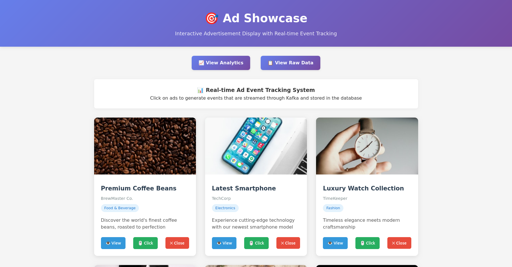
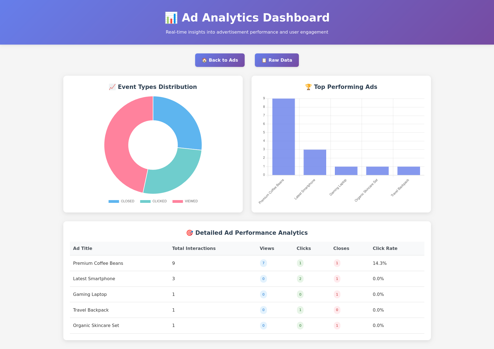
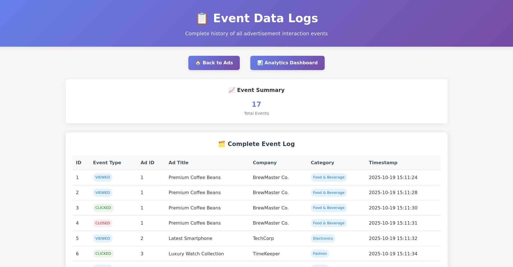

# Ad Event Tracking System

A distributed real-time ad event tracking system built with Spring Boot and Apache Kafka. This application demonstrates event-driven architecture for capturing, streaming, and analyzing advertisement interaction data.

## 🏗️ Architecture

The system consists of two Spring Boot microservices:

- **Frontend Service** (Port 8081): Web interface for generating ad events and data visualization
- **Backend Service** (Port 8080): Consumer service that processes Kafka messages and provides REST APIs

```
┌─────────────┐    Kafka Topics     ┌─────────────┐    MySQL    ┌─────────────┐
│   Frontend  │ ──────────────────► │   Backend   │ ──────────► │  Database   │
│  (Producer) │   ad_viewed         │ (Consumer)  │             │             │
│             │   ad_clicked        │             │             │             │
│             │   ad_closed         │             │             │             │
└─────────────┘                     └─────────────┘             └─────────────┘
```

## ✨ Recent Updates

### Enhanced Event Tracking (Latest)

- **Enriched Data Model**: Events now include ad company and category information
- **Improved UI Consistency**: Unified navigation and styling across all pages
- **Better Accessibility**: Enhanced contrast for close buttons and consistent button layouts
- **Streamlined Interface**: Removed external visit buttons for cleaner ad interaction focus

### UI/UX Improvements

- **Consistent Navigation**: Top-positioned navigation buttons on all pages
- **Optimized Button Layout**: All ad action buttons aligned in single row
- **Enhanced Data Display**: Company and category columns in raw data view
- **Professional Styling**: Gradient headers and consistent visual design

## 🚀 Features

- **Real-time Event Streaming**: Kafka-based message processing for ad interactions
- **Interactive Ad Display**: Visual ad showcase with real product advertisements
- **Event Tracking**: Automatic tracking of ad views, clicks, and closures with company and category metadata
- **Data Visualization**: Interactive charts showing event distribution, trends, and ad performance analytics
- **REST API**: Comprehensive endpoints for accessing event data, statistics, and ad-specific analytics
- **Persistent Storage**: MySQL database for event history with enriched ad metadata (company, category)
- **Responsive Design**: Mobile-friendly interface for ad interactions
- **Containerized Deployment**: Docker support with Kubernetes manifests

## 📸 Screenshots

### Ad Showcase - Interactive Display

*Main interface showing interactive ad cards with View, Click, and Close tracking buttons*

### Analytics Dashboard - Performance Insights

*Comprehensive analytics with event distribution charts and detailed ad performance metrics*

### Raw Event Logs - Complete Data View

*Detailed event history with timestamps, event types, and ad metadata including company and category information*

## 🛠️ Technology Stack

- **Java 17** - Programming language
- **Spring Boot 3.5.5** - Application framework
- **Apache Kafka** - Event streaming platform
- **MySQL** - Database for event persistence
- **Thymeleaf** - Template engine for web UI
- **Maven** - Build and dependency management
- **Docker** - Containerization
- **Kubernetes** - Container orchestration

## 📋 Prerequisites

- Java 17 or higher
- Maven 3.6+
- Apache Kafka < 4.0 (local or remote)
- MySQL 8.0+
- Docker (optional, for containerized deployment)

## 🏃‍♂️ Quick Start

### 1. Clone the Repository

```bash
git clone <repository-url>
cd ad-event-tracking-system
```

### 2. Start Infrastructure Services

**Option A: Local Setup**

- Start Kafka on `localhost:9092`
- Start MySQL on `localhost:3306` with database `ads_db`

**Option B: Docker Compose** (if available)

```bash
docker-compose up -d kafka mysql
```

### 3. Configure Database

Create MySQL database and user:

```sql
CREATE DATABASE ads_db;
CREATE USER 'ads_user'@'%' IDENTIFIED BY 'password';
GRANT ALL PRIVILEGES ON ads_db.* TO 'ads_user'@'%';
```

### 4. Run Applications

**Backend Service:**

```bash
cd backend
./mvnw spring-boot:run
```

**Frontend Service:**

```bash
cd frontend
./mvnw spring-boot:run
```

### 5. Access the Application

- **Ad Showcase**: http://localhost:8081 - Interactive ad display with event tracking
- **Analytics Dashboard**: http://localhost:8081/chart - Comprehensive ad performance analytics
- **Raw Data View**: http://localhost:8081/data - Detailed event logs
- **Backend API**: http://localhost:8080/api/events - All events endpoint
- **Event Counts API**: http://localhost:8080/api/events/counts - Aggregated statistics

## 🔧 Kafka Setup & Management

### Prerequisites

- **Apache Kafka version < 4.0** (tested with Kafka 3.8)
- Kafka must be running on `localhost:9092` for default configuration

### Starting Kafka Services

**1. Start Zookeeper** (in first terminal):

```bash
# Navigate to your Kafka installation directory
cd /path/to/kafka

# Start Zookeeper (runs on port 2181)
bin/zookeeper-server-start.sh config/zookeeper.properties
```

**2. Start Kafka Broker** (in second terminal):

```bash
# Start Kafka server (runs on port 9092)
bin/kafka-server-start.sh config/server.properties
```

### Topic Management

**Create Required Topics** (the application will auto-create these, but you can create them manually):

```bash
# Create ad_viewed topic
bin/kafka-topics.sh \
  --create \
  --topic ad_viewed \
  --bootstrap-server localhost:9092 \
  --partitions 1 \
  --replication-factor 1

# Create ad_clicked topic
bin/kafka-topics.sh \
  --create \
  --topic ad_clicked \
  --bootstrap-server localhost:9092 \
  --partitions 1 \
  --replication-factor 1

# Create ad_closed topic
bin/kafka-topics.sh \
  --create \
  --topic ad_closed \
  --bootstrap-server localhost:9092 \
  --partitions 1 \
  --replication-factor 1
```

**List All Topics**:

```bash
bin/kafka-topics.sh --list --bootstrap-server localhost:9092
```

### Testing Kafka Setup

**Monitor Ad Events** (useful for debugging):

```bash
# Monitor ad_viewed events
bin/kafka-console-consumer.sh \
  --bootstrap-server localhost:9092 \
  --topic ad_viewed \
  --from-beginning

# Monitor ad_clicked events
bin/kafka-console-consumer.sh \
  --bootstrap-server localhost:9092 \
  --topic ad_clicked \
  --from-beginning

# Monitor ad_closed events
bin/kafka-console-consumer.sh \
  --bootstrap-server localhost:9092 \
  --topic ad_closed \
  --from-beginning
```

**Manually Send Test Events** (for testing):

```bash
# Send test ad_viewed event
bin/kafka-console-producer.sh --broker-list localhost:9092 --topic ad_viewed
# Then type: {"eventType":"ad_viewed","timestamp":"2024-01-01T12:00:00Z","adId":1,"adTitle":"Test Ad","adCompany":"Test Company","adCategory":"Electronics"}

# Send test ad_clicked event
bin/kafka-console-producer.sh --broker-list localhost:9092 --topic ad_clicked
# Then type: {"eventType":"ad_clicked","timestamp":"2024-01-01T12:00:00Z","adId":1,"adTitle":"Test Ad","adCompany":"Test Company","adCategory":"Electronics"}
```

### Stopping Kafka Services

**Option 1: Use Ctrl+C** in the terminal windows running Zookeeper and Kafka

**Option 2: Use stop scripts**:

```bash
# Stop Kafka server first
bin/kafka-server-stop.sh

# Then stop Zookeeper
bin/zookeeper-server-stop.sh
```

### Kafka Configuration Notes

- **Bootstrap Servers**: Default `localhost:9092`
- **Consumer Group**: `ad-consumer-group` (configured in backend)
- **Auto Topic Creation**: Enabled by default
- **Message Format**: JSON with event metadata
- **Partitions**: Single partition per topic (suitable for development)
- **Replication Factor**: 1 (suitable for single-broker setup)

## 🔧 Configuration

### Environment Variables

**Backend Service:**

```bash
SPRING_KAFKA_BOOTSTRAP_SERVERS=localhost:9092
SPRING_DATASOURCE_URL=jdbc:mysql://localhost:3306/ads_db
SPRING_DATASOURCE_USERNAME=ads_user
SPRING_DATASOURCE_PASSWORD=password
```

**Frontend Service:**

```bash
KAFKA_BOOTSTRAP_SERVERS=localhost:9092
BACKEND_API_URL=http://localhost:8080/api/events
SERVER_PORT=8081
```

## 🐳 Docker Deployment

### Build Images

```bash
# Build backend image
cd backend
docker build -t ad-tracker-backend .

# Build frontend image
cd frontend
docker build -t ad-tracker-frontend .
```

### Run with Docker

```bash
# Run backend
docker run -p 8080:8080 \
  -e SPRING_KAFKA_BOOTSTRAP_SERVERS=kafka:9092 \
  -e SPRING_DATASOURCE_URL=jdbc:mysql://mysql:3306/ads_db \
  ad-tracker-backend

# Run frontend
docker run -p 8081:8081 \
  -e KAFKA_BOOTSTRAP_SERVERS=kafka:9092 \
  -e BACKEND_API_URL=http://backend:8080/api/events \
  ad-tracker-frontend
```

## 📊 API Endpoints

### Backend Service (Port 8080)

| Method | Endpoint                      | Description                                                   |
| ------ | ----------------------------- | ------------------------------------------------------------- |
| GET    | `/api/events`                 | Get all events                                                |
| GET    | `/api/events/counts`          | Get event counts by type                                      |
| GET    | `/api/events/counts/by-ad`    | Get total interactions per ad                                 |
| GET    | `/api/events/analytics/by-ad` | Get detailed analytics breakdown per ad with company/category |
| GET    | `/api/events/top-ads`         | Get top 10 performing ads by interactions                     |

### Frontend Service (Port 8081)

| Method | Endpoint      | Description                |
| ------ | ------------- | -------------------------- |
| GET    | `/`           | Main event generation page |
| POST   | `/send-event` | Send ad event to Kafka     |
| GET    | `/chart`      | Event visualization page   |
| GET    | `/data`       | Raw event data page        |

## 🧪 Testing

### Manual Testing

1. Access the ad showcase at http://localhost:8081
2. Interact with displayed ads:
   - **View**: Click the "👁️ View" button or ad image
   - **Click**: Click the "🖱️ Click" button to simulate ad clicks
   - **Close**: Click "✕ Close" to simulate closing an ad
3. View real-time analytics at `/chart` and raw data at `/data`
4. Check backend API at http://localhost:8080/api/events for all events
5. Monitor console logs for Kafka message processing

## 📁 Project Structure

```
├── backend/                 # Consumer service
│   ├── src/main/java/
│   │   └── com/example/backend/
│   │       ├── controller/  # REST controllers
│   │       ├── entity/      # JPA entities
│   │       ├── repository/  # Data access layer
│   │       └── service/     # Business logic
│   └── Dockerfile
├── frontend/                # Producer service & web UI
│   ├── src/main/java/
│   │   └── com/example/frontend/
│   │       ├── controller/  # Web controllers
│   │       ├── model/       # Data models
│   │       └── service/     # Kafka producers
│   ├── src/main/resources/templates/  # Thymeleaf templates
│   └── Dockerfile
└── README.md
```

## 🔍 Monitoring

- **Application Logs**: Check console output for Kafka message processing
- **Database**: Query `ad_event` table for stored events
- **Kafka Topics**: Monitor `ad_viewed`, `ad_clicked`, `ad_closed` topics

## 📝 License

This project is licensed under the MIT License - see the LICENSE file for details.

## 🆘 Troubleshooting

**Common Issues:**

1. **Kafka Connection Failed**: Ensure Kafka is running and accessible
2. **Database Connection Error**: Verify MySQL is running and credentials are correct
3. **Port Already in Use**: Check if ports 8080/8081 are available
4. **Maven Build Fails**: Ensure Java 17+ is installed and JAVA_HOME is set

**Logs Location:**

- Application logs: Console output
- Kafka logs: Check Kafka server logs
- Database logs: MySQL error logs
